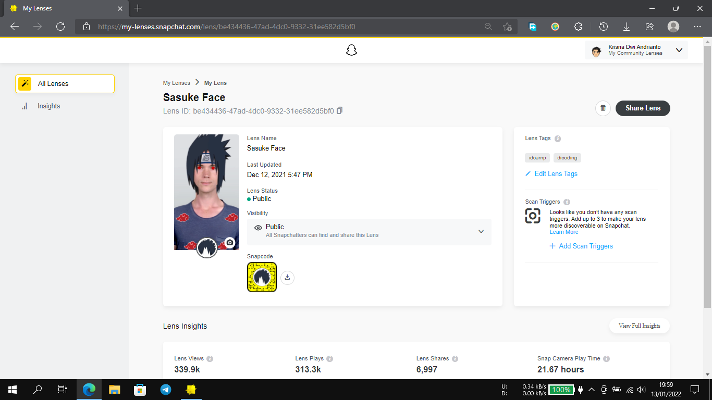
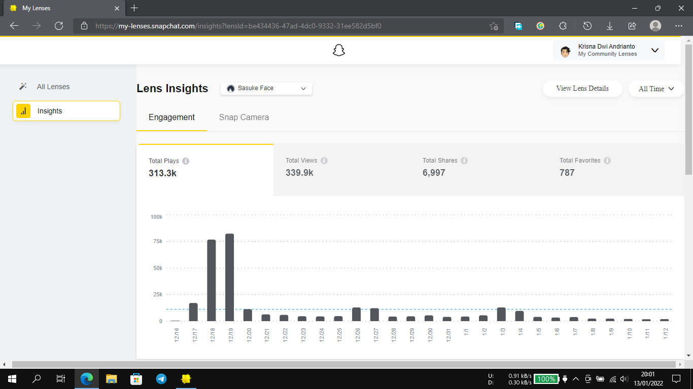

# simple-lens-project
Creating a Lenses with Lens Studio from Snapchat

https://www.dicoding.com/academies/313

Try this lenses: https://www.snapchat.com/unlock/?type=SNAPCODE&uuid=7c9e34ec1d7a475ab6f8e65737d1971a&metadata=01

## Lens Detail & Stats (13/01/2022)
&nbsp;&nbsp;&nbsp;
&nbsp;&nbsp;&nbsp;
